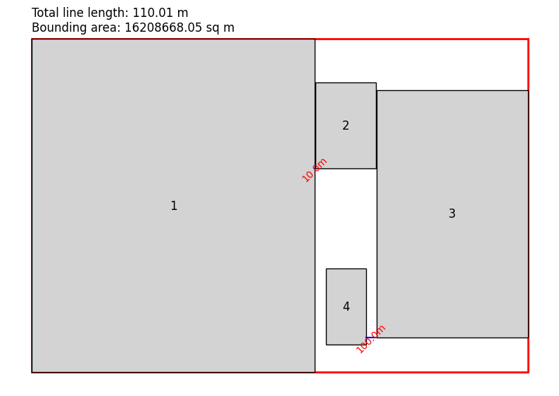

# Factory Optimizer

Factory Optimizer is a project designed to optimize the arrangement of factory buildingsso that the total used area is reduced and specific paths between buildings follow the given parameters while reducing their length as much as possible



## Table of Contents

- [Installation](#installation)
- [Usage](#usage)
- [Features](#features)

## Installation

1. **Clone the Repository**:

   ```bash
   git clone <repository-url>
   cd factory_optimizer

   ```

2. **Set Up Virtual Environment**

   ```bash
   python -m venv venv
   source venv/bin/activate  # On Windows use `venv\Scripts\activate`

   ```

3. **Set Up Virtual Environment**
   ```bash
   pip install -r requirements.txt
   ```

## Usage

```bash
python factory_optimizer.py
```

## Features

- **Optimization**: Optimizes the arrangement of rectangles to minimize wasted space while keeping the distances between them to a desired minimum.
- **NSGA-II Algorithm**: Utilizes the Non-dominated Sorting Genetic Algorithm II (NSGA-II) for multi-objective optimization.
- **Visualization**: Generates plots to visualize the optimized arrangements.
- **Configurable**: Easily configurable through a JSON configuration file.
